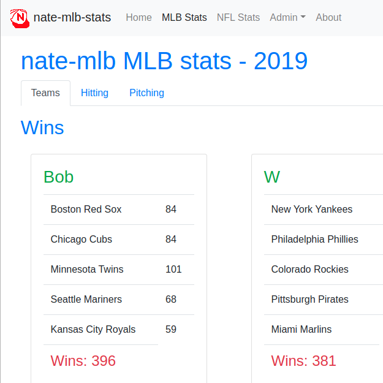

#  nate-mlb
A web server which compares MLB baseball scores and NFL football scores.

Built with the [Go](https://github.com/golang/go) programming language.

Runs on a [Firestore](https://firebase.google.com/docs/firestore) or [PostgreSQL](https://github.com/postgres/postgres) database.

[](https://github.com/jacobpatterson1549/nate-mlb/actions/workflows/docker-image.yml)
[](https://goreportcard.com/report/github.com/jacobpatterson1549/nate-mlb)
[](https://godoc.org/github.com/jacobpatterson1549/nate-mlb)

## Screenshot


## Dependencies
New dependencies are automatically added to [go.mod](go.mod) when the project is built.
* [pq](https://github.com/lib/pq) (PostgreSQL Driver)
* [firestore](cloud.google.com/go/firestore) (Firestore Driver)
* [bcrypt](https://github.com/golang/crypto) (password encryption)
* [Bootstrap](https://github.com/twbs/bootstrap) (css, html widgets)
* [Font-Awesome](https://github.com/FortAwesome/Font-Awesome) (icons on about page)

## Installation

### Docker
Launching the application with [Docker](https://www.docker.com) requires minimal configuration and runs a Postgres database locally.
1. Install [docker-compose](https://github.com/docker/compose)
1. Set environment variables in a `.env` file in project root (next to Dockerfile).  The ports are mapped from the container to the docker host. Sample:
```
POSTGRES_DB=nate_mlb_db
POSTGRES_USER=nateUser
POSTGRES_PASSWORD=natePass12345
POSTGRES_PORT=54320
PORT=8000 
APPLICATION_NAME=nate-mlb
```
3. Run `docker-compose up` to launch the application.
1. Access application by opening <http://localhost:8000>.

### Run locally

#### Database
The server expects to use a PostgreSQL or Firestore database.

* **Firestore**: The `DATABASE_URL` environment parameter should be set to something like `firestore://PROJECT_ID`, where PROJECT_ID is the name of the Google project the database is tied to.   The computer running the application must be authenticated for the project.  This should not be a problem when running on the Google Cloud, but personal computers must be authenticated with `gcloud auth application-default login`.  No other configuration should be needed.

* **Postgres**: See [Database Setup](sql/README.md) for instructions on creating a PostgresQL database.

#### Set environment variables
The following environment variables should be set or provided:
* **PORT** The server expects the PORT environment variable to contain the port to run on (eg: 8000). **REQUIRED**
* **DATABASE_URL** The server expects the DATABASE_URL environment variable to contain the dataSourceName.  See [Database Setup](sql/README.md). **REQUIRED**
* **ADMIN_PASSWORD** The administrator password to edit years/players/friends on the site.
* **APPLICATION_NAME** The name of the application server to display to users  Visible on the site and on exports.
* **PLAYER_TYPES** A csv whitelist of [PlayerType](https://godoc.org/github.com/jacobpatterson1549/nate-mlb/go/db#PlayerType) ids to use.  If present, limits player types.  For example, when `4,5` is used, only player types nflTeam and nflQB will be shown; nfl will also be the only sport shown.
* **NFL_APP_KEY** The application key used to get data from the nfl data source at https://api.fantasy.nfl.com.

#### Compile and run server
There are three main ways to compile and run the server:
* **Build** The server can be compiled with `go build`.  The binary can be run with `./nate-mlb`.
* **Install** The server can be compiled with `go install`.  The installed binary can be run with `$GOPATH/bin/nate-mlb`.
* **1-Command** To compile and run the server with a single command command, run `go run main.go`.

### Heroku
1. Provision a new app on [Heroku](https://dashboard.heroku.com/apps).
1. Provision a [Heroku Postgres](https://www.heroku.com/postgres) **add-on** on the **Overview** (main) tab for the app.
1. Configure additional environment variables on the **Settings** tab.  The PATH and DATABASE_URL variables are automatically.
1. Connect the app to this GitHub repository on the **Deploy** tab.
1. Trigger a **Manual deploy** on the **Deploy** tab.
